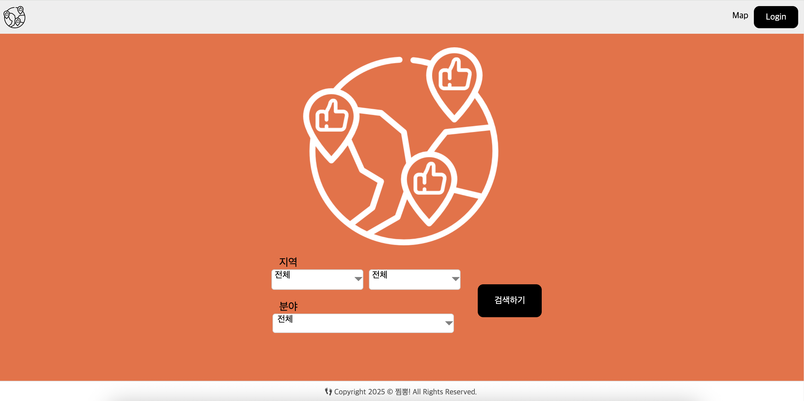

# 📌 JJimppong! - *여행 후기 커뮤니티*
<div align="center">
<h3>찜뽕 여행 후기 커뮤니티 서비스</h3>
</div>



<div align="center">
<h3><a href="http:///" target="_blank">배포 링크 - http:///</a></h3></div>


## 📖 프로젝트 개요
지역 주민들의 생생한 여행·지역 정보를 공유하는 커뮤니티 서비스.  
계정 등급 시스템으로 활발한 정보 갱신을 유도하고, 지도 API로 게시글과 지역 정보를 연동해 직관적인 정보 탐색 제공.

## ✨ 주요 기능
- 회원가입, 로그인
- 카카오, 네이버 로그인
- 여행 후기 게시글 작성, 수정, 삭제
- 여행 후기 좋아요, 싫어요, 조회수 조회
- 지도 페이지 지역별 축제, 팝업스토어, 맛집 리스트 정보 제공

## 🖥️ 기술 스택
- React.js
- TypeScript
- React Router DOM
- React Daum Postcode
- Naver Maps JavaScript API v3
- Axios
- fetch API
- dotenv
- GeoJSON

## ✈️ 프로젝트 실행 방법
```bash
# 1. 클론 및 폴더 이동
git clone https://github.com/sw-lee-dev/Project-jjimppong-front.git
cd jjimbbong-front
```
```bash
# 2. 패키지 설치
npm install
```
```bash
# 3. 개발 서버 실행
npm run start
```
```bash
# 4. 빌드
npm run build
```

## 📦 환경 변수 설정
```bash
# .env 파일
REACT_APP_API_DOMAIN=http://localhost:4000
REACT_APP_API_URL=http://localhost:3000
REACT_APP_NAVER_CLIENT_ID=zgdo8rbm3b
```

## 🗂️ 폴더 구조
```md
📂 PROJECT-FRONT
├ 📂 src / # React 소스 코드 파일들   
│ ├ 📂 apis
│ │ └ 📂 dto
│ ├ 📂 assets
│ ├ 📂 components
│ ├ 📂 constants
│ ├ 📂 hooks
│ ├ 📂 layouts
│ ├ 📂 map
│ ├ 📂 stores
│ ├ 📂 types
│ ├ 📂 utils
│ └ 📂 views
│   ├ 📂 Auth
│   ├ 📂 Board
│   ├ 📂 Main
│   └ 📂 MyPage
├ 📂 public / # 정적 파일(HTML, 이미지, data)  
├ 📃 .env / # 환경 변수 파일 
├ 📄 package.json / # 프로젝트 설정 및 의존성 정보 
└ 📄 tsconfig.json / # TypeScript 설정 파일  
```

## 📄 라이센스
### Copyright (c) <2025> jjimppong